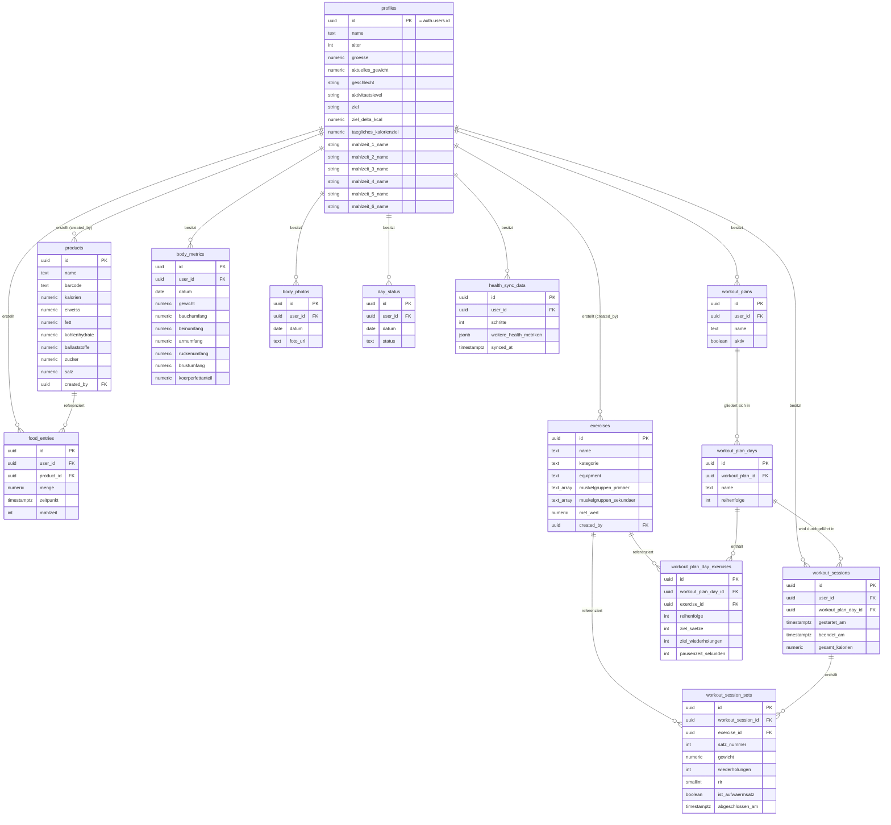

# Domänenmodell & ERD

Lebendes Dokument — bei jeder neuen Migration (`supabase/migrations/*.sql`) hier nachziehen, damit Diagramm und Domänenbeschreibung immer den tatsächlichen DB-Stand widerspiegeln. Quelle der Wahrheit ist die jeweils neueste Migration; dieses Dokument ist die menschenlesbare Projektion davon.

## Bereiche

- **Nutzer & Profil** — `profiles`, 1:1 mit Supabase Auth (`auth.users`)
- **Ernährung** — `products` (Community-Datenbank), `food_entries`
- **Training** — `exercises`, `workout_plans`, `workout_plan_days`, `workout_plan_day_exercises`, `workout_sessions`, `workout_session_sets`
- **Körper** — `body_metrics`, `body_photos`
- **Kalender** — `day_status`
- **Health-Sync** — `health_sync_data`

Jede Tabelle (außer `profiles`, das per Trigger `handle_new_user` automatisch angelegt wird) hat Row-Level-Security: Nutzer sehen/ändern ausschließlich eigene Zeilen (`user_id = auth.uid()`), mit Ausnahme der geteilten Community-Tabellen `products` und `exercises` (für alle authentifizierten Nutzer lesbar, aber nur vom Ersteller änderbar).

## ERD

## Fachliche Notizen

- `products` und `exercises` sind geteilte Community-Tabellen (kein `user_id`-Owner-Filter beim Lesen), `created_by` markiert nur, wer den Eintrag ursprünglich angelegt hat.
- `day_status` (geplanter Status) und `workout_sessions` (tatsächlich durchgeführtes Training) sind bewusst getrennt — das Home-Dashboard gleicht Plan gegen Realität ab.
- `body_metrics` und `day_status` haben je einen `unique (user_id, datum)`-Constraint — pro Nutzer und Tag genau ein Eintrag.
- `profiles.geschlecht/aktivitaetslevel/ziel/ziel_delta_kcal` speisen die Mifflin-St-Jeor-Berechnung des Kalorienziels (`src/lib/nutrition-goal.ts`); `taegliches_kalorienziel` überschreibt die Berechnung, wenn gesetzt. `products.barcode` hat seit Phase 2 einen Unique-Index für nicht-null-Werte (`products_barcode_unique`).
- `profiles.mahlzeit_1_name` bis `_6_name` benennen sechs feste Mahlzeiten-Slots; `food_entries.mahlzeit` verweist als stabile Nummer 1–6 darauf und ist `null`, solange ein Eintrag keinem Abschnitt zugeordnet ist. Bewusst keine Array-Positionen: Beim Entfernen eines Abschnitts würden sonst alle nachfolgenden Einträge still auf den falschen Abschnitt zeigen.
- `workout_plan_days` gibt einem Trainingsplan mehrere benannte Tage (z. B. „Push"/„Pull"/„Legs"); `workout_plan_day_exercises` hängt an einem Tag statt direkt am Plan, `workout_sessions.workout_plan_day_id` verweist auf den konkreten trainierten Tag. Welcher Tag als Nächstes ansteht, ergibt sich zur Laufzeit aus dem zuletzt **abgeschlossenen** Tag desselben Plans (Rotation, keine eigene Spalte) — kein Kalender beteiligt.
- `gesamt_kalorien` in `workout_sessions` wird einmalig bei „Training abschließen" berechnet (MET-Durchschnitt über alle Sätze × `profiles.aktuelles_gewicht` × Dauer) und danach nicht rückwirkend neu berechnet, auch wenn sich der MET-Wert einer verwendeten Übung später ändert.
- `exercises.met_wert` stammt beim Import aus einer Zuordnung Kategorie → MET (`src/lib/met-categories.ts`), nicht aus einem Wert je Übung. Importierte Zeilen tragen `created_by = null` und unterscheiden sich dadurch von selbst angelegten Übungen.
- `workout_plan_day_exercises` hat einen Unique-Index auf `(workout_plan_day_id, exercise_id)` — dieselbe Übung kann in einem Tag nur einmal vorkommen, sonst teilen sich zwei Zeilen im Live-Training eine `exercise_id` (gemeinsame Satzzählung, falsche `satz_nummer`).
- `workout_sessions.workout_plan_day_id` ist `on delete set null`: eine abgeschlossene Session ist die Aufzeichnung des tatsächlich Trainierten und überlebt das Umbauen oder Löschen des Plans — sie verliert nur ihre Beschriftung.
- Genau ein Plan je Nutzer ist aktiv. Das Umschalten macht die Funktion `activate_workout_plan(plan_id uuid)` in **einem** Statement (`security invoker`, prüft die Eigentümerschaft selbst); zwei Requests aus dem Client konnten dazwischen scheitern und gar keinen aktiven Plan hinterlassen.
- `workout_session_sets.satz_nummer` ist eine reine Reihenfolge-Nummer über **alle** Sätze einer Übung, Aufwärmsätze eingeschlossen. Die Zählung „Satz 1 von 3" wird in der Oberfläche aus den Sätzen mit `ist_aufwaermsatz = false` abgeleitet; die Datenbank nummeriert nichts um, wenn ein Aufwärmsatz dazwischen liegt.
- `workout_session_sets.rir` (0–5, „wie viele Wiederholungen wären noch gegangen", 0 = keine) und `body_metrics.koerperfettanteil` sind nullable: sie wurden nachträglich eingeführt und für ältere Zeilen ist der Wert schlicht unbekannt. `ist_aufwaermsatz` ist `not null default false` — jeder vor der Einführung erfasste Satz war aus Sicht der Volumen-Auswertung ein Arbeitssatz.
- `products.ballaststoffe/zucker/salz` liegen wie die übrigen Nährwerte je 100 g vor. **Salz, nicht Natrium** — Open Food Facts liefert beides, deutsche Etiketten drucken Salz.
- `body_photos.foto_url` speichert den Objektpfad im privaten Bucket `body-photos`, nicht eine URL. Angezeigt wird über kurzlebige signierte Links; der Bucket ist nicht öffentlich, die Policies prüfen den ersten Pfadabschnitt gegen `auth.uid()`.
- `profiles.aktuelles_gewicht` trägt das Gewicht des `body_metrics`-Eintrags mit dem neuesten Datum und wird nach jedem Schreiben und Löschen dort nachgezogen.
- Quelle: `supabase/migrations/0001_initial_schema.sql` (Stand Phase 2 + Mahlzeiten-Abschnitte + Phase 3 (Trainingsbereich) + Analysefelder, inkl. `0002_nutrition_profile_fields.sql`, `0003_meal_sections.sql`, `0004_training_days.sql`, `0005_analysis_fields.sql` und `0006_body_photos_bucket.sql`).
