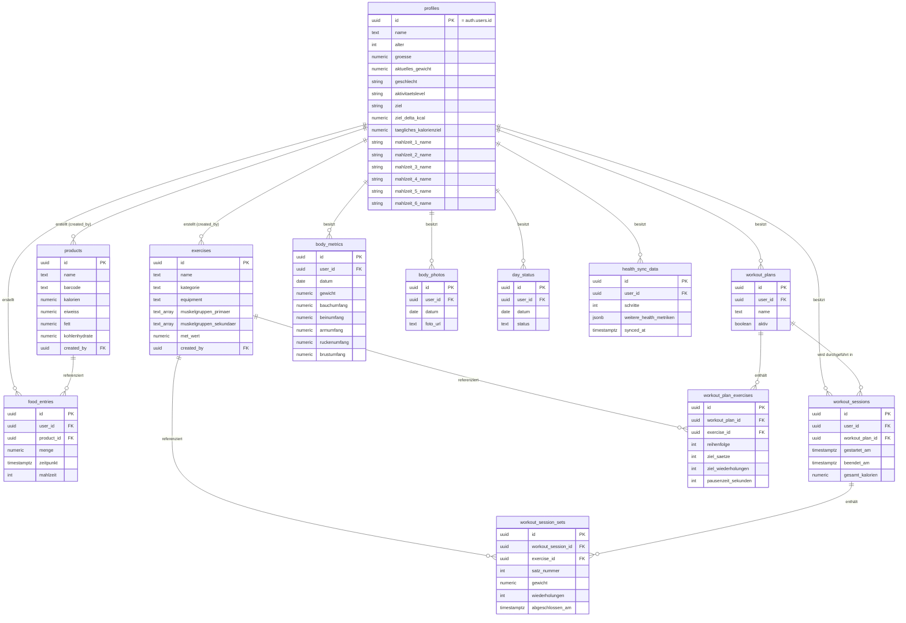

# Domänenmodell & ERD

Lebendes Dokument — bei jeder neuen Migration (`supabase/migrations/*.sql`) hier nachziehen, damit Diagramm und Domänenbeschreibung immer den tatsächlichen DB-Stand widerspiegeln. Quelle der Wahrheit ist die jeweils neueste Migration; dieses Dokument ist die menschenlesbare Projektion davon.

## Bereiche

- **Nutzer & Profil** — `profiles`, 1:1 mit Supabase Auth (`auth.users`)
- **Ernährung** — `products` (Community-Datenbank), `food_entries`
- **Training** — `exercises`, `workout_plans`, `workout_plan_exercises`, `workout_sessions`, `workout_session_sets`
- **Körper** — `body_metrics`, `body_photos`
- **Kalender** — `day_status`
- **Health-Sync** — `health_sync_data`

Jede Tabelle (außer `profiles`, das per Trigger `handle_new_user` automatisch angelegt wird) hat Row-Level-Security: Nutzer sehen/ändern ausschließlich eigene Zeilen (`user_id = auth.uid()`), mit Ausnahme der geteilten Community-Tabellen `products` und `exercises` (für alle authentifizierten Nutzer lesbar, aber nur vom Ersteller änderbar).

## ERD

## Fachliche Notizen

- `products` und `exercises` sind geteilte Community-Tabellen (kein `user_id`-Owner-Filter beim Lesen), `created_by` markiert nur, wer den Eintrag ursprünglich angelegt hat.
- `day_status` (geplanter Status) und `workout_sessions` (tatsächlich durchgeführtes Training) sind bewusst getrennt — das Home-Dashboard gleicht Plan gegen Realität ab.
- `body_metrics` und `day_status` haben je einen `unique (user_id, datum)`-Constraint — pro Nutzer und Tag genau ein Eintrag.
- `profiles.geschlecht/aktivitaetslevel/ziel/ziel_delta_kcal` speisen die Mifflin-St-Jeor-Berechnung des Kalorienziels (`src/lib/nutrition-goal.ts`); `taegliches_kalorienziel` überschreibt die Berechnung, wenn gesetzt. `products.barcode` hat seit Phase 2 einen Unique-Index für nicht-null-Werte (`products_barcode_unique`).
- `profiles.mahlzeit_1_name` bis `_6_name` benennen sechs feste Mahlzeiten-Slots; `food_entries.mahlzeit` verweist als stabile Nummer 1–6 darauf und ist `null`, solange ein Eintrag keinem Abschnitt zugeordnet ist. Bewusst keine Array-Positionen: Beim Entfernen eines Abschnitts würden sonst alle nachfolgenden Einträge still auf den falschen Abschnitt zeigen.
- Quelle: `supabase/migrations/0001_initial_schema.sql` (Stand Phase 2 + Mahlzeiten-Abschnitte, inkl. `0003_meal_sections.sql`).
